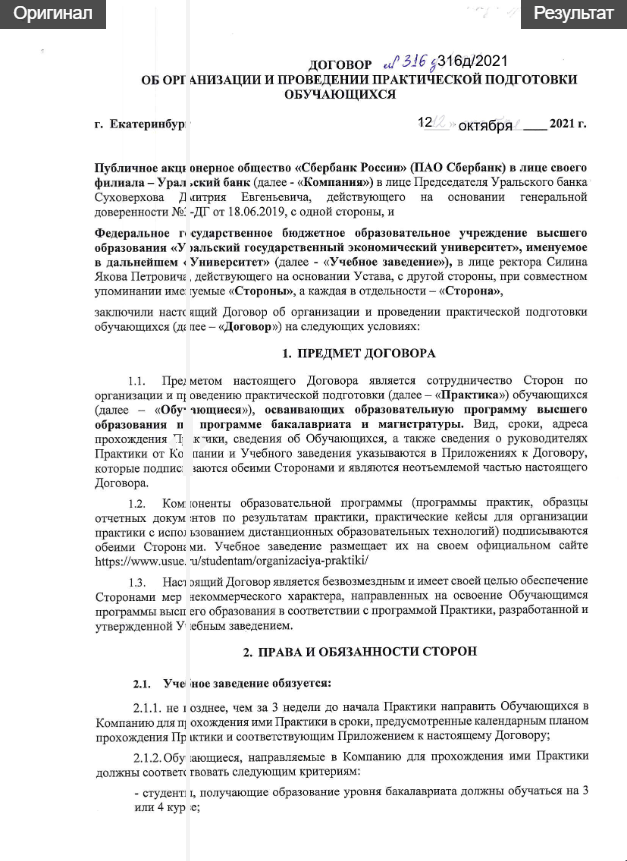

# DocuScribe: Распознавание и замена рукописного текста

[](https://documentocrproject-beffpafdrj9jxrg3xddedi.streamlit.app/)

DocuScribe — это веб-приложение, предназначенное для автоматического обнаружения и замены рукописного текста в документах на печатный.


 

## 📝 Описание задачи

Часто возникает необходимость перевести рукописные заметки, анкеты или архивные документы в печатный формат. Ручной ввод занимает много времени и подвержен ошибкам. Этот проект автоматизирует данный процесс с помощью моделей машинного обучения.

## 🚀 Основной функционал

**DocuScribe** — это интерактивное веб-приложение, созданное с использованием Streamlit. Оно предоставляет пользователю простой интерфейс для выполнения следующих операций:
- **Загрузка файлов:** Поддерживаются форматы изображений (`.jpg`, `.png`, `.jpeg`) и PDF.
- **Обнаружение текста:** Модель на базе YOLOv11m находит области с рукописным текстом на документе.
- **Распознавание текста:** Модель на базе TrOCR распознает текст в каждой найденной области.
- **Замена текста:** Исходный рукописный текст на изображении заменяется на аккуратную печатную версию с сохранением фона.
- **Интерактивное редактирование:** Пользователь может скорректировать распознанный текст прямо в интерфейсе перед сохранением финального результата.
- **Сохранение результатов:** Обработанное изображение можно скачать в формате `.png`, а весь распознанный текст — в виде файла `.txt`.

## ⚙️ Окружение и установка

Проект использует `pixi` для управления зависимостями в локальной среде и `requirements.txt` для развертывания на Streamlit Cloud.

### Локальный запуск

1.  **Установите Pixi:** Следуйте [официальной инструкции](https://pixi.sh/latest/installation/).
2.  **Клонируйте репозиторий:**
    ```bash
    git clone https://github.com/Chaberis/DocumentOCR_Project.git
    cd DocumentOCR_Project
    ```
3.  **Установите зависимости:** `pixi` автоматически создаст окружение и установит все необходимое.
    ```bash
    pixi install
    ```
4.  **Запустите приложение:**
    ```bash
    pixi run start
    ```

## 🧠 Модели и данные

В проекте используются 2 модели. 

- **Модель детекции текста:**
  - **Архитектура:** YOLOv12m
  - **Веса:** [Chaberis/docu_scribe_yolov12m](https://huggingface.co/Chaberis/docu_scribe_yolov12m)

- **Модель распознавания текста:**
  - **Архитектура:** TrOCR (Transformer OCR)
  - **Веса:** [kazars24/trocr-base-handwritten-ru](https://huggingface.co/kazars24/trocr-base-handwritten-ru)


## 📂 Структура проекта
```
.
├── assets/
├── src/
│   ├── app.py
│   ├── processing.py
│   ├── download_models.py
│   └── config.py
├── .gitignore
├── packages.txt
├── pixi.toml
└── requirements.txt
```

Этот проект распространяется под лицензией MIT. Подробности смотрите в файле `LICENSE`.